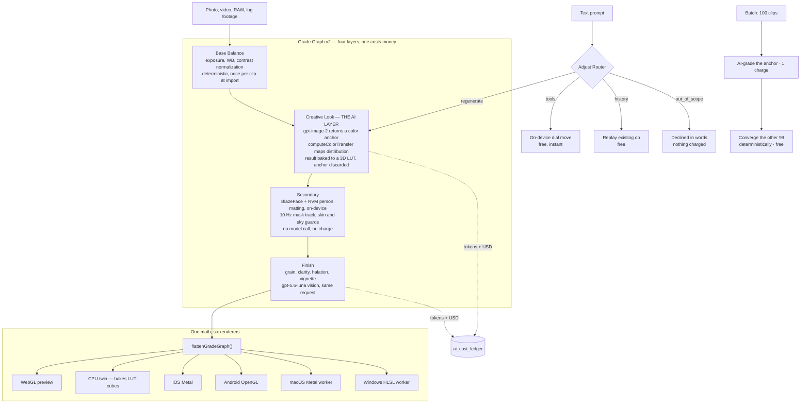
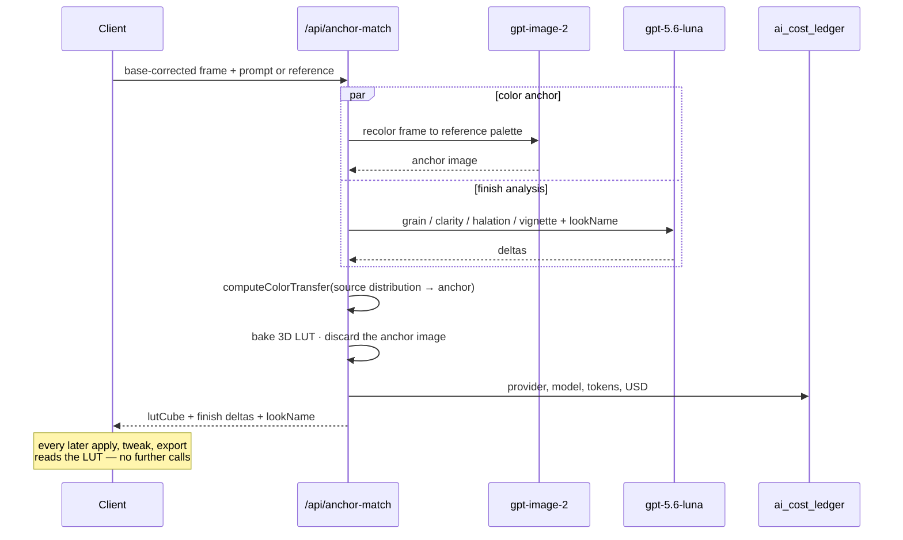

# Fauve — an AI color assistant that had to be cheap to run

**[ai.flexpresets.com](https://ai.flexpresets.com)** · Founder & Product Manager · 2026–present
· Desktop (macOS + Windows), iOS, Android, Web

Describe a look in plain language — in any of eleven languages — or hand Fauve a reference
image, and it grades your photos and video and keeps every layer editable. It protects skin
automatically, matches a hundred clips to one another, and exports ProRes, DNxHR, HDR and
standard `.cube` LUTs.

The hard constraint was not color quality. It was making the product cheap enough to run that a
one-time licence stays solvent for years — which is an architecture problem, not a pricing one.

Fauve is the AI-native evolution of FlexPresets, a photography presets and LUT business I ran
for five years.

> ### At a glance
>
> **Context** — FlexPresets sold static presets and LUTs for five years. Its AI-native successor
> had to actually grade a customer's own footage, on every platform they shoot and edit on, and
> stay cheap enough to run that it could be sold once rather than rented.
>
> **What I owned** — product direction, UX, the AI architecture, pricing, releases and customer
> operations. Four surfaces from one codebase: desktop (macOS and Windows), iOS, Android, web.
> An agentic editing layer that interprets a request against the current grade and executes real
> operations, including refusing the ones it shouldn't. A perpetual licence across nine
> currencies, replacing subscriptions without disturbing existing subscribers.
>
> **The core decision** — every look costs exactly one model call; the base correction, the skin
> and sky protection, the batch matching and every export are deterministic and free. That is
> what makes a one-time price survivable, and the rest of this write-up is how it was enforced.
>
> **Where it stands** — 1.0 shipped end of August 2026 and it is on 1.2.2 now. Shipped through
> App Store review, Play Console and Windows release. Too early for meaningful revenue.

Source code is private. This is the public write-up.

---

## The system



---

## Request lifecycle: one grade

Both model calls live inside a single `/api/anchor-match` request and cost one AI grade
together. Everything downstream of the LUT is deterministic and free.



Discarding the anchor is the load-bearing decision. Solving it into a LUT makes the result
robust to the model reframing or resizing the image, keeps the grade editable instead of
collapsing into an opaque transform, and means re-applying a saved look costs nothing forever.

**Batch amortises the same call.** Grading a set runs one AI grade on an anchor clip, then
converges every other clip onto it with deterministic matching. A 100-clip project is one
charge. Photo projects are unlimited; video projects cap at 100 clips, mobile batches at 20.

---

## The Adjust Router

Every plain-text prompt goes through `/api/adjust-router` before anything expensive happens;
reference-match requests skip it entirely.

The router reads the current grade as **notches** — every control is a dial with five notches
per side, `value = (notch / 5) × the control's own range`, defined once in `@flexpresets/core`
so desktop and mobile share one vocabulary with no hand-tuned step tables to drift apart. It
returns **absolute destinations, never movements**, so re-running the same request is
idempotent rather than compounding.

It then picks one of five scopes:

| Scope | Example | Cost |
|---|---|---|
| `tools` | "lift the shadows a bit" | Free — applied on-device, instantly |
| `regenerate` | "golden hour" | One AI grade |
| `history` | undo / redo / reset | Free — replays an operation the app already holds |
| `out_of_scope` | "remove the person" | Free — declined in words |

This holds from the very first prompt: "brighter" on a freshly imported photo moves the exposure
dial for free instead of spending a grade on it. Clients declare `availableControls` and
`availableRegions` rather than the server inferring capability from a platform string.

The router is a pricing decision implemented as a routing system, and it is the piece of the
product I would point at first.

**It has an eval harness with a ship bar**, because scope misclassification is the one failure
that either charges a user for nothing or refuses work they paid for. 156 calls, about $0.03 a
run — cheap enough that the prompt gets tuned and re-run until it passes rather than argued about.

The bar: scope accuracy ≥90% on every configuration, **`out_of_scope` recall 100%** — a missed
out-of-scope prompt costs the user a grade, so there is no acceptable miss rate — zero
colour-wheel leaks on mobile, zero region leaks, and ≥80% region routing where regions were
offered. The primary readout is a scope confusion matrix; the `tools → regenerate` cell is
literally the user complaint *"it regenerates instead of using its tools"* turned into a number.

It runs three configurations, because "make the person brighter" has a different correct answer
in each: desktop (43 controls, global only), mobile with a person detected (37 controls, three
regions), mobile without (37 controls, global only). Two of the guards are two-sided on purpose —
the configuration that offers a region must pick it, and the one that does not must answer
`global` every time. That second direction is the normalizer's job rather than the model's, so a
single failure there is a normalizer bug, not a prompt-tuning problem.

The most useful thing the harness taught was about itself. Until August 2026 no test case named a
person or a background, so a router answering `global` to everything scored a clean 100%. Nothing
was actually broken at the time — the router was right and the mobile client was withholding the
regions — but **the eval could not have distinguished right-for-the-right-reason from
right-by-accident, which is the entire point of having one.**

---

## The one expensive call, and three attempts to delete it

Reference matching — "make my footage look like this photo" — is the only place in the product
that spends real money, so it is the place I tried hardest to make free. Three times. Each attempt
was measured, and each time the measurement said keep paying.

**First attempt: no model at all.** Solve the LUT directly from the source and reference pixel
distributions — pure statistics, zero inference cost. It shipped, and it was rejected for unstable
quality. The reason is the whole problem in one sentence: **a statistical solver has no semantic
understanding**, so if the reference is half sky and the source contains none, the sky's colours
get applied to whatever happens to occupy that part of the histogram. Sometimes gorgeous,
frequently wrong, never predictable.

**The fix defines what the model is actually for.** The shipping architecture inserts an *anchor*:
an image model re-renders the source frame recoloured to the reference's palette, keeping the
composition, and the LUT is then solved from source → anchor rather than source → reference. The
anchor's only job is **semantic correspondence — skin to skin, sky to sky.** It is not there to
be creative or to produce the final image; it is there so the deterministic maths knows which
region is which. Then it is discarded.

That framing is what makes the cost defensible. You are not paying a model to grade your photo.
You are paying it once, for correspondence, and every pixel operation afterwards is free.

**Second attempt: give the model eyes instead of numbers.** A measurement harness — drive the
real app, grade a fixed source against a fixed reference, measure the rendered canvas and the
reference with the pipeline's own scope maths, diff, fix, repeat — found four failures worth
knowing about:

1. **A subsystem was silently dead.** The async grading endpoint rebuilt its request through an
   allowlist that happened to drop the reference scope, so the deterministic target builder never
   ran for any async match. Nothing errored; the feature quietly did something else.
2. **The metric was satisfiable the wrong way.** The solver chased average luma and tonal range
   but nothing pinned the absolute black point, so the cheapest route to "brighter" was floating
   the whole histogram. The numbers matched; the blacks were visibly lifted. A target you can hit
   while looking wrong is not a target.
3. **The loop was grading an image nobody saw.** The offscreen renderer used for measurement
   shared the shader but hand-copied its uniform feeding, and never set the finish-layer uniforms
   or the secondary mask. It converged beautifully, on a picture that was never on screen.
4. **Two decision-makers were fighting.** The model emitted tonal parameters open-loop, landing
   about 0.3 of luma from the target it was nominally serving, and the deterministic loop spent
   its entire iteration budget undoing them.

All four were fixed, and the reference-target, converge and scope-analysis modules that came out
of it are still in the shipping product with their test suites. But the exercise surfaced a
ceiling that fixing bugs could not move: what the model could communicate to the renderer was
about **fifteen scope statistics, and infinitely many looks satisfy the same fifteen numbers.**
Where saturation sits by hue, the split-tone structure, the texture — none of it survives that
encoding.

So a prototype went the other way: one decision-maker, a closed loop, the real grading controls,
and actual sight of the live preview between rounds, up to eight rounds. It was built and
documented, and **it is not in the product.**

It was killed on latency first. Each round is one vision call at three to eight seconds, so a
match ran twenty-five seconds to a minute — against a single request for the shipped path. Nobody
waits a minute to see whether a look landed, and a colour tool that cannot be iterated on quickly
is not a colour tool. The economics finished the argument: eight vision calls per match, in a
product whose entire pricing rests on expensive calls being rare, did not pay for the quality it
bought.

The quality insight survived the prototype, though — it is why the anchor exists at all, and why
the model is asked for correspondence rather than for a finished grade.

**Third attempt: move the model on-device.** If the anchor is the cost, run it locally. The
candidate was a 2026 CVPR model that outputs an image-adaptive 17³ LUT — task-exact, since a LUT
is already the native artifact — about 5M parameters, roughly 10 MB, smaller than the CLIP model
already running in the browser, 8 ms per frame on GPU, standard ONNX ops, and Apache-2.0 licensed
including the weights. The drivers were written down in priority order: **cost first, speed
second.**

Phase 0 was an evaluation, not an integration. Fourteen real source/reference pairs, scored by Lab
palette distance to the reference and by eye. **Verdict: FAIL.** Mean distance 13.7 for the cloud
model against 20.2 for the local one, with the cloud model closer on thirteen of the fourteen
pairs. The experiment was closed and Phase 1 was never built. The write-up records the caveat
honestly — the paper's primary checkpoint link was broken, so vendor-default weights were used —
which is the difference between a verdict and an excuse.

**The expensive call stayed because it earned its cost.** That is a less exciting conclusion than
replacing it would have been, and it is the one the measurements supported.

---

## How decisions get recorded

There are 136 dated design documents in this repo covering May through August 2026 — pricing
ladders, the HDR pipeline, native export parity, the notched-tools router redesign, the perpetual
licence, each mobile release. Significant changes get a written design before they get code.

More usefully, experiments get a **verdict file**. Two of them read FAIL: the on-device anchor
model above, and a subject-separation experiment closed the same way. Writing down what was tried
and rejected — with the numbers, and with the caveats that weaken your own conclusion — is what
stops a team relitigating the same idea every quarter, and it is the only part of this that
compounds.

## Cross-platform color: one artifact, not six ports

Getting identical pixels out of a WebGL preview, an iOS Metal renderer, an Android GL renderer
and three native export workers is normally a discipline problem — port carefully, test, hope.
Fauve makes it a structural one.

Every grade compiles down to a single canonical artifact:

```
CanonicalLook = {
  cube:   ColorCube                              // 33³ RGB LUT, red-fastest
  finish: { grain, clarity, halation, vignette } // spatial, per-platform
}
```

The split is not arbitrary. **A per-pixel LUT can represent any colour-to-colour transform** —
exposure, contrast, temperature and tint, saturation, the log wheels, tone curves, the 8-band
HSL mixer, the secondary qualifier, the skin guard — so all of them bake into `cube`. What a LUT
*cannot* represent is anything spatial: noise, local contrast, bloom, position-dependent
darkening. Exactly those four stay as scalars and are implemented per renderer.

Which gives the guarantee, quoting the engine doc: *identical `cube` + identical `finish` ⇒
identical pixels, within renderer epsilon. That is the no-drift guarantee, by construction.*

The cube layout is pinned everywhere — size 33, 35,937 triples, red-fastest indexing
(`idx = ((b*33 + g)*33 + r) * 3`) chosen to match Apple's `CIColorCube` so iOS can hand the bytes
straight to Core Image. iOS consumes the cube and skips the parametric colour stages entirely,
because they are already in it. Web renders from the graph and ignores the cube; consuming it for
bit-exact parity exists behind a flag.

**Three tests make drift impossible to ship:**

- **Parity guard** — the baked cube, sampled, must match the CPU shader port within trilinear
  tolerance across several real grades. If the baker and the renderer diverge, the build fails.
- **Completeness guard** — every `Grade` key and every colour trim key must appear in
  `BAKED_COLOR_KEYS`, and the only un-baked keys must be exactly the four spatial ones. **Adding
  a new control without classifying it as colour or spatial fails the build.** That is the rule
  that stops a parameter silently becoming platform-specific again — the failure mode the whole
  design exists to prevent, caught at compile time rather than in a user's export.
- **Golden fixture** — a fixed grade's baked cube and sampled outputs are recorded; the iOS
  Core Image output is spot-checked on-device against those exact numbers.

Plus roughly 231 instrumented pixel-parity tests on Android comparing rendered output device-side.

**Persistence is a billing decision.** Web strips the LUT on save and recomputes it on load — the
cube never hits disk. iOS persists the grade graph verbatim, ~562 KB of base64 cube included, so
reopening a project renders correctly with no rehydrate. The reason is not storage: rehydrating
would re-run the grade, and re-running the grade **would cost the user a credit.** A budget test
guards that a cube-bearing state stays well under the 2 MB state cap, so a future larger cube
cannot silently 413 someone's save.

## Entitlement and billing

Fauve sells a **perpetual licence**, not a subscription. New customers pay once — list US$129,
locally priced across nine currencies — and own it. `SUBSCRIPTIONS_OPEN = false` flipped the
transition: the checkout API refuses new subscription line items with a 410, while existing
subscribers keep renewing against their original price IDs, untouched.

Ownership resolves as a fifth `provider` in the access layer rather than a new `AccessState`, so
every `state !== "locked"` call site kept working without modification — the migration was a
switch, not a rewrite.

```
active ──(payment fails)──▶ grace (5-day dunning) ──(expires)──▶ locked
```

`assertActiveAccess(userId)` gates every protected endpoint server-side. The page-level paywall
is cosmetic; the API guard is the boundary that matters.

Fair use meters only real AI grades. Tweaks, saved-look re-applies, batch follow-on clips and
exports are all free, which is why the included allowance is documented in the code as *"an
anti-abuse gate, not a billing unit — median usage makes it last years."* That sentence is only
writable because the expensive operation is rare by design.

Three payment rails run underneath — Stripe for web and desktop, Apple in-app purchase, Google
Play billing — each with its own server-to-server notification endpoint, plus a scheduled job
that sweeps store refunds back into entitlement.

Currency resolves in a fixed order: an explicit `fauve_ccy` cookie override, then geo-IP
country, then USD. A currency with no Stripe `currency_option` on the target price is never
exposed, because showing a price the checkout cannot charge is worse than showing USD.

---

## Surfaces

**Desktop is the flagship** — an Electron shell around the studio with native render workers
(Swift/Metal on macOS, Rust on Windows, Rust/wgpu as the universal fallback) and bundled FFmpeg.
It imports the acquisition formats a browser cannot — ProRes, DNxHR, log footage, RAW, HEIC,
TIFF — and masters them locally at full quality. Projects are local `.fauveproject` packages;
original media never uploads.

**Mobile** is an Expo app for iOS and Android with its own native camera — Apple Log and ProRAW
on iOS, HLG10 and RAW DNG on Android — a 34-look live viewfinder dial, and batch grading against
the same API.

**Web** carries the marketing funnel, checkout and account center; the browser studio still
works but new investment goes to desktop.

56 API routes back all of it, split roughly into grading and AI (`anchor-match`,
`adjust-router`, `reference-rank`, `scene-suggestions`, `projects/[id]/interpret`), async jobs
(`grading-jobs`, `export-jobs` with cancellation), commerce (`billing/*`, `stripe/webhook`,
`apple/*`, `google/*`), lifecycle crons (`cron/retention`, `cron/winback`, `cron/meta-spend`,
`cron/iap-refunds`), and operations (`admin/ai-costs`, `admin/saas-metrics`, `job-metrics`,
`telemetry`, `account/usage`).

---

## What each model is for

| Model | Role |
|---|---|
| `gpt-image-2` | The color anchor — the only image model in production |
| `gpt-5.6-luna` | Finish analysis, adjust router, project command planner, memory summarizer, track and scene suggestions, reference ranking |
| CLIP `clip-vit-base-patch32` | On-device scene classification and find-similar embeddings |
| RVM `rvm_mobilenetv3` | On-device person matting, ONNX worker |
| MediaPipe BlazeFace | On-device face detection |

Text roles run with low reasoning effort, low verbosity and prompt caching. Per-call token usage
and USD cost land in `ai_cost_ledger`, surfaced through an internal AI-cost dashboard and a
per-account usage view.

A cheaper image-model fast path was trialled and removed in August 2026 — the fourth entry in the
pattern above — and the removal is left in the route as a tombstone explaining why, so nobody
re-derives it in six months.

Everything not in that table is deterministic: the LUT solve, the cross-clip convergence, the skin
and sky guards. **That boundary is the product.** Above it, one call for semantic understanding;
below it, code that costs nothing to run a thousand times.

---

## Why this one is different

Two products came before this.

[**Zyras**](https://github.com/jimmy1220fbab/zyras-case-study) was an AI-native NPI operating
system for hardware teams, built out of a year and a half as a PM at ASUS. The product worked.
The route to market was an accelerator whose ODM network would have been the distribution
channel; it reached the final interview round and was not selected, and selling NPI software
factory by factory is a field sales motion I was not going to win. **A product without a channel
is a hobby.**

[**Vocuz**](https://github.com/jimmy1220fbab/vocuz-case-study) was an AI learning platform where
the platform generated the courses. I built per-model cost instrumentation into it early, which
turned out to be the most useful thing in the codebase: it showed that a large course — around
1,400 slides once you count narration audio, imagery and three languages — cost more to
manufacture than the pricing could carry, with speech synthesis and image generation dominating.
Without funding to buy time, that is not a growth problem, it is an arithmetic one. **Unit
economics are a design input, not a reporting output.**

Fauve inherits both answers. It launched into a market I already knew how to reach — five years
of running acquisition for FlexPresets, at up to NT$500K a month in paid media across nine
currencies, means the channel was a measured quantity rather than an assumption. Unit economics
were designed in from the first commit — one AI call per
look, deterministic everything else, rendering on the customer's own hardware — which is exactly
what makes a one-time licence viable where a subscription would have been mandatory.

---

## Stack

Next.js + TypeScript · Electron desktop shell with native render workers (Swift/Metal, Rust,
Rust/wgpu) · Expo for iOS and Android with native camera and renderer modules · `packages/core`
shared color math · Supabase Postgres · Stripe + Apple IAP + Google Play billing · on-device
CLIP, RVM and MediaPipe via ONNX and WASM · bundled FFmpeg · 56 API routes · golden-file and
cross-platform pixel-parity test suites

> **Source code is private.** Happy to walk through any part of it in an interview.
