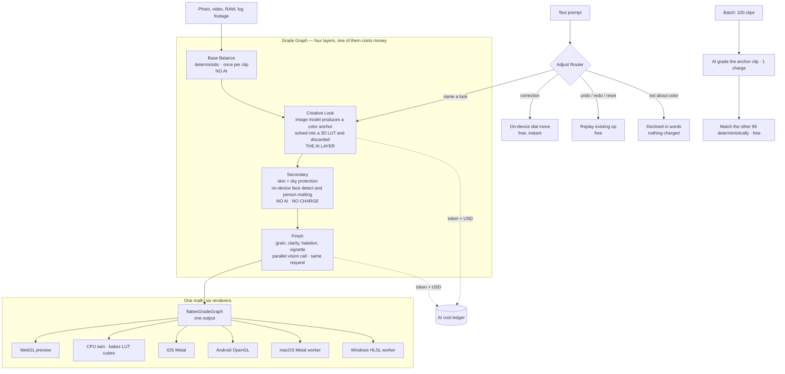

# Fauve — an AI color assistant that had to be cheap to run

**[ai.flexpresets.com](https://ai.flexpresets.com)** · Founder & Product Manager · 2026–present
· Desktop (macOS + Windows), iOS, Android, Web

Describe a look in plain language — in any of eleven languages — or hand Fauve a reference
image, and it grades your photos and video and keeps every layer editable. It protects skin
automatically, matches a hundred clips to one another, and exports ProRes, DNxHR, HDR and
standard `.cube` LUTs.

The interesting constraint was not making the color good. It was making the product cheap
enough to run that I could sell it for a fixed price, once, and still be solvent in three years.

Fauve is the AI-native evolution of FlexPresets, a photography presets and LUT business I ran
for four years — which is where its customers came from.

Source code is private. This is the public write-up.

---

## The system

---

## The pricing decision came first

Fauve sells a **perpetual licence**, not a subscription. New customers pay once — list US$129,
with local pricing in nine currencies — and own it.

You cannot sell a perpetual licence on a product whose cost of goods recurs every time someone
uses it. So the licence was not a marketing decision made at the end. It was a constraint set
at the start, and the architecture below is what it takes to satisfy it.

The included AI-grade allowance is documented in the codebase as *"an anti-abuse gate, not a
billing unit — median usage makes it last years."* That sentence is only writable if the
product is designed so that the expensive operation is rare and the valuable operations are
free.

Transitioning was a switch, not a rewrite: new subscription line items are refused at the
checkout API, while existing subscribers keep renewing against their original prices,
untouched. Entitlement resolves through one access layer, so ownership slotted in as another
provider rather than a new state every call site had to learn.

---

## Making AI rare without making the product worse

**Only one of four grade layers is a model call.** Base balance — exposure, white balance,
contrast normalization — is computed deterministically from the image's own scope, once, at
import. Skin and sky protection are deterministic too: on-device face detection and person
matting produce a mask track that every renderer multiplies into the protection weight. Those
run free, on the user's machine, every time. The model is only asked for the thing a model is
actually needed for: what the look *is*.

**And its answer is converted into something reusable.** The image model returns a color anchor;
a deterministic transfer step maps the source's color distribution onto it and bakes a 3D LUT.
The anchor image is then thrown away — only the compact LUT is saved. That has three
consequences: the result is robust to the model reframing or resizing the image, the grade
stays editable rather than collapsing into an opaque transform, and re-applying a saved look
costs nothing forever.

**A hundred clips cost one grade.** Batch mode grades a single anchor clip with AI, then
converges every other clip onto it with deterministic matching. A 100-clip set is one charge.

**The router decides what is free.** Every text prompt goes through an adjust router that reads
the current grade and picks one of five scopes. Asking for "shadows a bit higher" is a
correction — applied on-device, instantly, free. Undo, redo and reset replay an operation the
app already holds. A request that is not about color is declined in words, and nothing is
charged. Only naming a new look actually spends a grade. This holds from the very first prompt:
"brighter" on a freshly imported photo moves the exposure dial for free rather than spending a
grade on it.

That router is a pricing decision implemented as a routing system, and it is the single piece
of the product I would point at first.

**Targets are absolute, never relative.** The router expresses every control as notches on a
dial with the value derived from the control's own range, and returns absolute destinations
rather than movements — so re-running the same request is idempotent instead of drifting
further each time. The vocabulary is defined once in a shared core package, so desktop and
mobile speak the same language with no per-platform step tables to fall out of sync. Clients
declare which controls and regions they can actually render instead of the server inferring it
from a platform name.

**Every call is priced.** Token usage and USD cost per call go to a ledger; text roles run with
low reasoning effort, low verbosity and prompt caching. An internal AI-cost dashboard and
per-account usage view sit on top. One image-model fast path was trialled and removed after
evaluation — there is an eval harness in the repo for exactly this — and the removal is left in
the code as a tombstone explaining why.

---

## One math, six renderers

The color math is written once as a spec and ported verbatim into six surfaces: the WebGL
preview, a CPU twin that bakes LUT cubes and does server renders, iOS Metal, Android OpenGL,
and the macOS Metal and Windows HLSL export workers. The shared types — the grade, the
parametric tone curve, notch steps, adjustment ranges, HDR transfer math — live in one package
consumed by web, mobile and scripts.

Parity is not assumed; it is tested. Golden-file comparisons, cross-implementation suites
between the shader and its CPU twin, and roughly 231 instrumented pixel-parity tests on Android
enforce that what you see in the preview is what lands in the master.

This matters commercially as much as technically. It is what allows the heavy work — actually
pushing pixels, at 4K, in ProRes — to run locally on hardware the customer already paid for.
Marginal cost per export is zero, which is the other half of why a perpetual licence closes.

---

## Shipping on four surfaces

**Desktop is the flagship** — an Electron shell around the studio with native render workers and
bundled FFmpeg. It imports the acquisition formats a browser cannot: ProRes, DNxHR, log
footage, RAW, HEIC and TIFF, and masters them locally at full quality. Projects are local
packages; original media never uploads.

**Mobile** is an Expo app for iOS and Android with its own native camera — Apple Log and ProRAW
on iOS, HLG10 and RAW DNG on Android — a live viewfinder look dial, and batch grading, against
the same API.

**Web** is the marketing funnel, checkout and account center; the browser studio still works.

Three payment rails run underneath: Stripe for web and desktop, Apple in-app purchase, and
Google Play billing, each with its own server-to-server notification endpoint, and a scheduled
job that sweeps store refunds back into entitlement. Access is enforced server-side on every
protected endpoint and derives active → grace → locked from billing state; the page-level
paywall is cosmetic, the API guard is the real boundary.

Retention and win-back run as scheduled jobs, and ad spend syncs on a cron so acquisition cost
sits next to the revenue it produced.

---

## Why this one is different

Two products came before this.

[**Zyras**](https://github.com/jimmy1220fbab/zyras-case-study) was an AI-native NPI operating
system for hardware teams, built out of a year and a half as a PM at ASUS. The product worked.
The route to market was an accelerator whose ODM network would have been the distribution
channel; it reached the final interview round and was not selected, and selling NPI software
factory by factory is a field sales motion I was not going to win. **It taught me that a
product without a channel is a hobby.**

[**Vocuz**](https://github.com/jimmy1220fbab/vocuz-case-study) was an AI learning platform where
the platform generated the courses and users bought them cheaply on top of a subscription. I
built per-model cost instrumentation into it early, which turned out to be the most useful thing
in the codebase: it showed that a large course — on the order of 1,400 slides once you count
narration audio, imagery and three languages — cost more to manufacture than the pricing could
carry, with speech synthesis and image generation dominating. Without funding to buy time, that
is not a growth problem, it is an arithmetic one. **It taught me that unit economics are a
design input, not a reporting output.**

Fauve inherits both answers. Distribution came from FlexPresets' existing customer base rather
than being wished for. Unit economics were designed in from the first commit — one AI call per
look, deterministic everything else, rendering on the customer's own hardware — which is
precisely what makes a one-time licence viable where a subscription would have been mandatory.

---

## Stack

Next.js + TypeScript · Electron desktop shell with native render workers (Swift/Metal on macOS,
Rust on Windows, Rust/wgpu as universal fallback) · Expo for iOS and Android with native camera
and renderer modules · shared core package for color math · Supabase Postgres · Stripe, Apple
IAP and Google Play billing · on-device CLIP, person matting and face detection via ONNX and
WASM · 56 API routes · golden-file and cross-platform pixel-parity test suites

> **Source code is private.** Happy to walk through any part of it in an interview.
